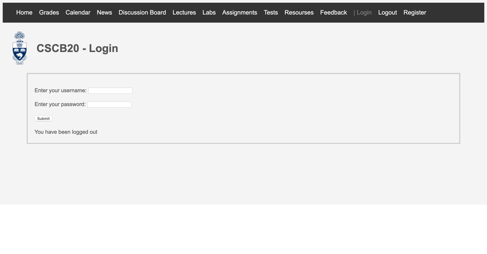
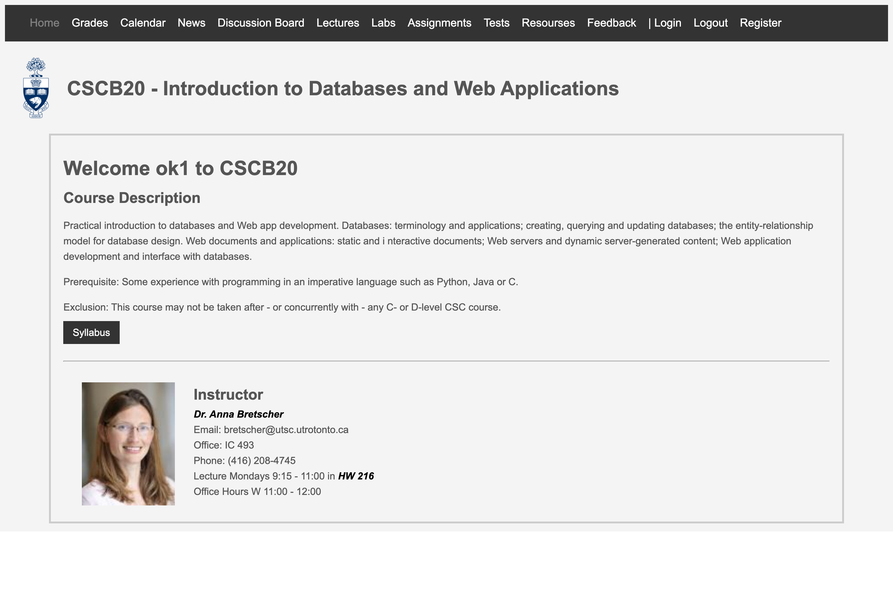
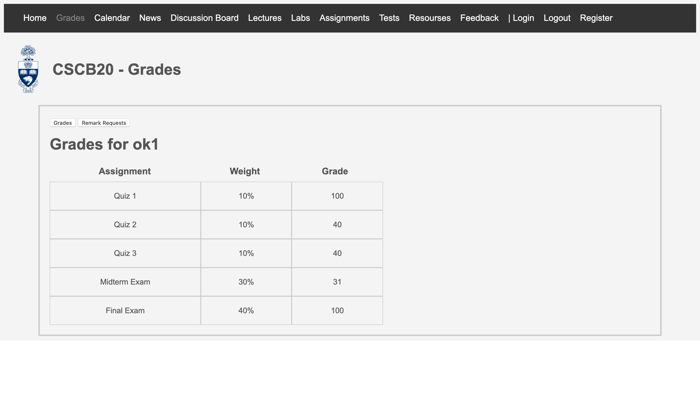
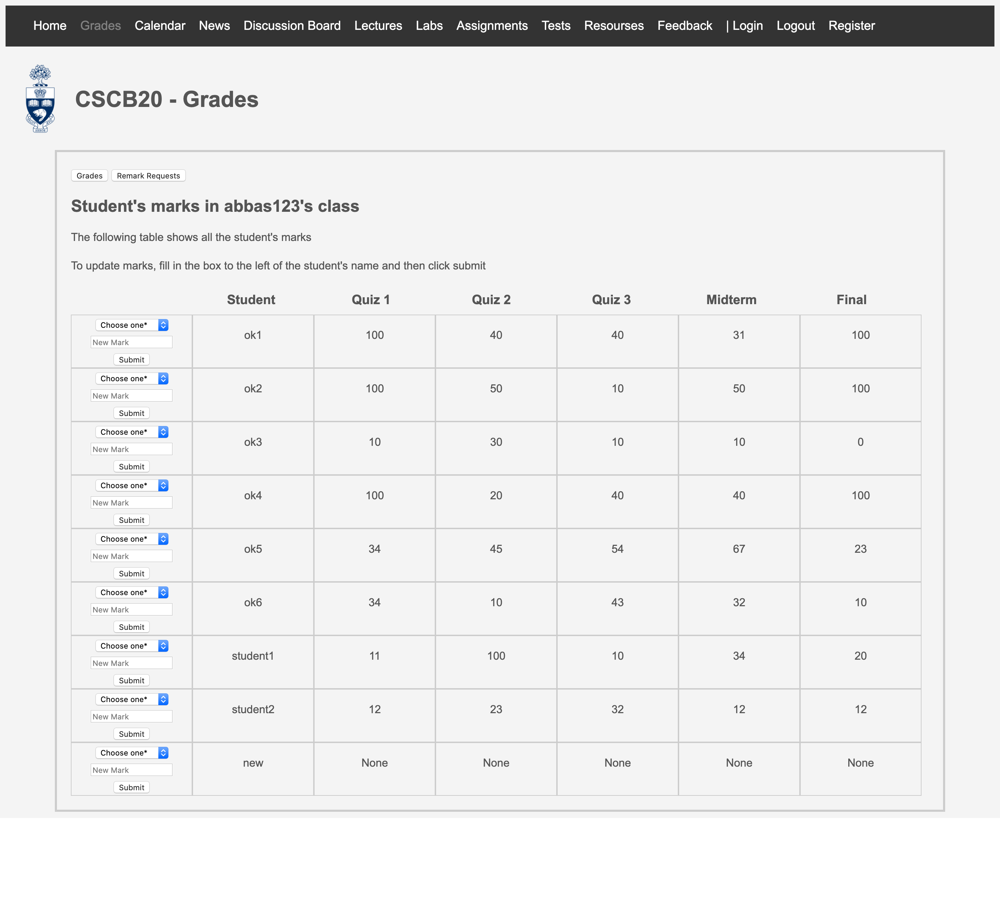
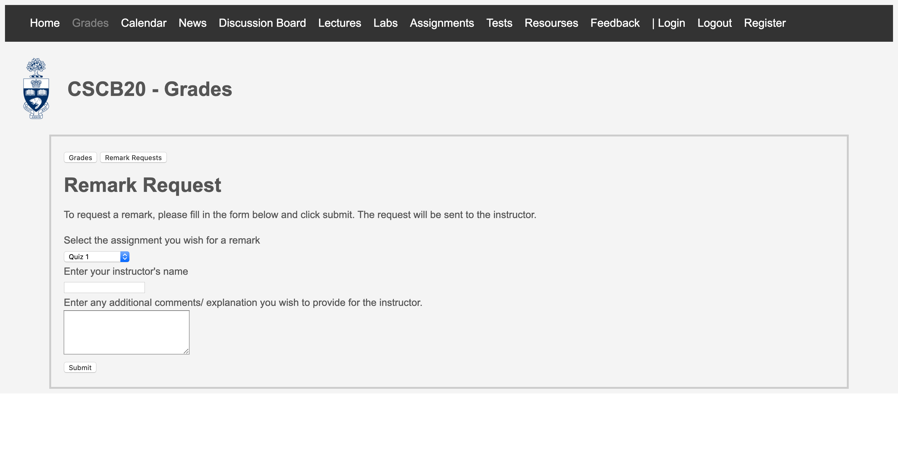
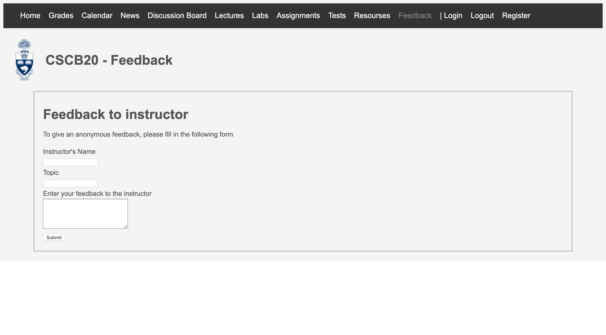
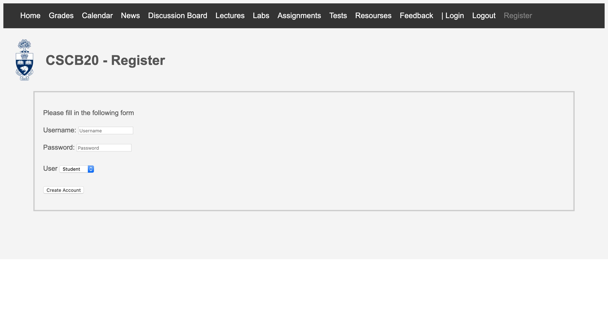

# Course-Website
## Goals
* Implement user authentication and confirmation
* Session management/ security
* Communicate in real time between the frontend and backend
* Utlized databases to store and manage data

## Description
Designed and developed responsive website using HTML, CSS, and Javascript for frontend and Python for backend. Also used jQuery, SQL, and Flask

Login example:
Student
* username: ok1
* password: ok1
Instructor
* username: abbas123
* password: abbas123

Modules used for this website
* flask
* flask_sqlalchemy
* sqlalchemy
* sqlalchemy.sql
* sqlalchemy.ext.automap
* datetime

## Files
* app.py file contains the main code 
* database.db is a dataset that contains 4 tables with dummy inputs
  * feedbacks
  * marks
  * remark
  * users
* Template folder contains all the html files
* Static folder contains the css and js file and other images used
  * syllabus.pdf is used as a dummy pdf for all pdf files
  * Powerpoints-Handouts-dummy-file.pdf is used as a dummy pdf for all lecture slides
  
## Main Functions Implemented
* Two different user types (student and instructor)
* Login
  * Login information will be verified
  * Any errors will be prompted as a message
* Register
  * Website can't already be logged in to register for a new account
  * Verifies that there's atleast one character input to prevent any 'empty' usernames and passwords
  * Verifies the username does not already exist 
  * Any errors will be prompted with a message
* Grades
  * Can update and edit grades
  * Can toggle between viewing grades or viewing regrade request
  * Students can view their grades and request a grade remark 
  * Instructors can view all student's grades
  * Instructors can all the remark requests
  * Instructors can edit and update student's grades
* Feedback
  * Students can submit feedbacks to specific instructors anonymously
  * Instructors can only view feedbacks specifically directed to them
  
## Preview of some pages
Login Page

Home Page

Grades  
Student's View

Instructor's View

Remark Requests  

Feedback  

Register

